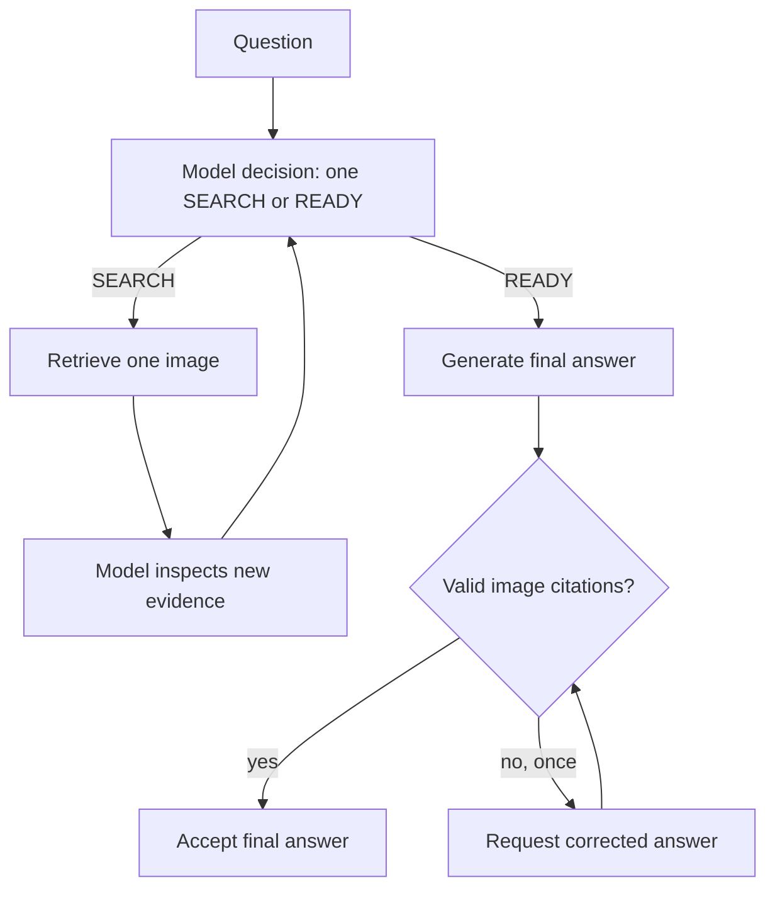

# Piano: grounding e multi-retrieval affidabili

## Motivazione

Il retriever trova gli elementi corretti, ma il modello non rispetta stabilmente
il protocollo di decisione e le citazioni. Serve una piccola modifica al
contratto del loop, non un altro aggiustamento isolato del prompt.

L'invariante architetturale è: **una sola azione esterna per turno, seguita
sempre da una nuova decisione del modello dopo aver osservato il risultato**.
Non vengono introdotte code o esecuzioni automatiche di `SEARCH(...)` extra.

## Implementazione

- In [`src/prompts.py`](../../src/prompts.py), separare decisione e risposta:
  prima e dopo ogni retrieval il modello emette `SEARCH("...")` oppure `READY`;
  soltanto dopo `READY` riceve la richiesta di risposta finale.
- In [`src/orchestrator.py`](../../src/orchestrator.py), eseguire solo il primo
  `SEARCH(...)` valido per turno, aggiungere l'immagine e richiamare il modello
  per una nuova decisione.
- Prima di accettare la risposta finale, richiedere almeno una citazione
  `Image N` esistente e consentire una sola correzione.
- Usare [`scripts/evaluate_minimal.py`](../../scripts/evaluate_minimal.py) per
  verificare due casi single-retrieval e due multi-retrieval.
- Sincronizzare [`docs/ARCHITECTURE.md`](../../docs/ARCHITECTURE.md) e
  [`docs/NOTES.md`](../../docs/NOTES.md) senza dichiarare risolto ciò che non
  supera la valutazione.

## Flusso

## Risultato attuale

La valutazione MLX è stata eseguita, ma la soluzione resta parziale: i due casi
multi-retrieval trovano entrambe le immagini in sequenza, mentre il modello
ripete ricerche già soddisfatte. `READY` compare nei casi semplici, ma tre
risposte su quattro continuano a omettere le citazioni.

## Limite intenzionale

La validazione controlla azioni e label, ma non tenta di comprendere
semanticamente se ogni parte arbitraria della domanda è stata coperta.
