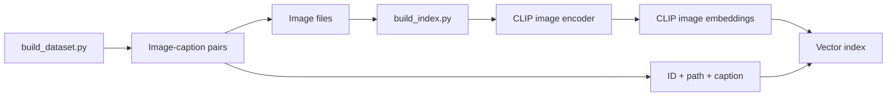
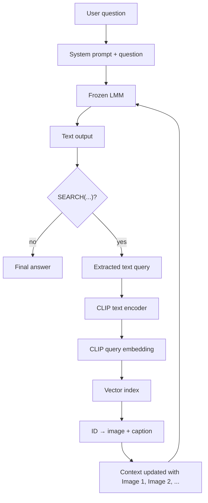

# ARCHITECTURE.md — Agentic Multimodal RAG: how the system works

> This file explains the theory and structure of the system. It helps me (the student)
> understand and explain each component. It does not contain operational setup instructions:
> those are in the repository README.

## 1. The idea in one sentence

A small **frozen** multimodal model (LMM) receives a complex question about the real
world; when it realizes that it lacks visual evidence, it issues a search request;
an external Python loop intercepts it, retrieves relevant images from a local database,
and reinserts them into the model's context; the model inspects them and produces a
final answer that **explicitly cites and comments on** the retrieved images.

The difference compared with classic RAG: retrieval does not happen only once before
generation, but is **decided by the model, during reasoning, even multiple times**
(agentic pattern).

## 2. The components

```
┌─────────────┐     question     ┌──────────────────┐
│    User     │ ───────────────▶ │   ORCHESTRATOR   │  ◀── the project's "brain":
└─────────────┘                  │   (Python loop)   │      a while loop, written by us
                                 └────────┬─────────┘
                                          │ prompt + context
                                          ▼
                                 ┌──────────────────┐
                                 │   LMM (frozen)    │  e.g. Qwen2-VL-2B via MLX
                                 │                   │  emits text; sometimes contains
                                 └────────┬─────────┘  the SEARCH("...") trigger
                                          │
                        trigger? ── yes ──┤─── no ──▶ final answer
                                          ▼
                                 ┌──────────────────┐
                                 │    RETRIEVER      │  query → CLIP embedding →
                                 │  (CLIP + index)   │  top-k search in the index →
                                 └────────┬─────────┘  returns ID → loads file
                                          │
                                          ▼
                            [images + captions] reinserted
                            into context → back to the LMM
```


### 2.1 LMM (Large Multimodal Model) — frozen

- Small (2B), open-weight model, run locally. No training, no fine-tuning:
all behavior is achieved through **prompting**.
- Why small: (a) it runs on my hardware; (b) it has real knowledge gaps, so
retrieval is genuinely needed and its effect is measurable; (c) orchestration matters,
and the model does not compensate for our errors.
- Why frozen: it is a project requirement; our intelligence lies in the loop,
not in the weights.


### 2.2 Retriever

- **Vector index** built offline: for each (image, caption) pair in the
dataset, we calculate an embedding with **CLIP** and save it in **FAISS** (or ChromaDB).
- At runtime: the textual query emitted by the model is encoded with the same CLIP,
the k nearest neighbors are searched, and the result **IDs** are obtained.

⚠️ **Key conceptual point — the two embedding spaces.**
CLIP embeddings exist only inside the index and are used only to *search*. The LMM never
sees them: the retriever returns IDs → from the IDs we load the **files** (image + text) →
the files are passed to the LMM as a normal input image, and the model
re-encodes them with *its own* internal vision encoder. There is no direct bridge between the
CLIP space and the LMM space (building one would require a trained module — out of scope).

### 2.3 Orchestrator

- A `while` loop in pure Python. Pseudocode:

```python
context = system_prompt + question
for step in range(MAX_STEPS):
    output = lmm.generate(context)
    trigger = extract_search(output)        # regex on SEARCH("...")
    if trigger is None:
        return output                       # final answer
    results = retriever.search(trigger, k=K)   # → [{image_path, caption, id}]
    context = update_context(context, output, results)
return fallback()                           # iteration limit reached
```

- No agentic frameworks (LangChain, etc.): the loop IS the project's contribution,
and small models require full control over the literal prompt.


### 2.4 Dataset

- Prototype: **50–100 image-caption pairs** in ONE domain, collected
quickly (e.g. from Wikimedia Commons), in the format:
  - `data/images/<id>.jpg`
  - `data/metadata.jsonl` → one line per item: `{"id": ..., "image": ..., "caption": ...}`
- Final project: 2,000–5,000 pairs (Wikipedia / WikiWeb2M subset). The format remains
identical: changing scale does not change the code.


## 3. End-to-end flow: from the index to the answer

The system has two distinct stages:

1. **Offline preparation**: we build the dataset and index only once.
2. **Runtime**: for each question, the LMM decides whether to search and the orchestrator runs
  the loop until the final answer.


### 3.1 Offline index preparation




For each item in the dataset, we keep two things associated with the same ID:

- the **image file**, which will actually be shown to the LMM;
- the **textual caption**, which will be added to the context as text.

In the prototype, the index contains only the CLIP embeddings of the **images**. The captions
are saved as metadata: we neither calculate nor save embeddings for them. This choice
corresponds to `text2image` mode: a text query searches directly for images
in CLIP's shared space.

### 3.2 Runtime: one question, one loop iteration




In order:

1. The LMM receives the question and the system prompt.
2. If it needs visual evidence, it produces text in the format
  `SEARCH("visual description")`. This is not native tool calling: it is a textual
   convention interpreted by our code.
3. The orchestrator extracts the description from the text with a regex.
4. The retriever passes that description to the **CLIP text encoder** and obtains a
  query embedding.
5. FAISS compares the query embedding with the image embeddings and returns
  the most similar positions.
6. From the results, the retriever obtains the ID, image path, and associated caption.
7. The orchestrator inserts the actual images, captions, and labels
  `Image 1`, `Image 2`, etc. into the context; it then calls the LMM again.
8. The LMM inspects the images and generates an answer that cites the images used.


### 3.3 Why the CLIP embedding is not given to the LMM

CLIP is used only to choose **which files to retrieve**. When the retriever has
found an image, it passes the file to the LMM, not its CLIP embedding:

```text
query → CLIP text encoder → FAISS → image file + caption → LMM
```

The LMM has its own internal vision encoder, which transforms the image into the
representation that its language decoder can use. CLIP embeddings and the LMM's
internal embeddings occupy different spaces and are not interchangeable; connecting them would require a
trained module, which is out of scope.

The caption, on the other hand, is passed as a normal text string: the LMM tokenizer
automatically transforms it into the necessary tokens.

### 3.4 Map of files and responsibilities


| File                            | Role                                                                    |
| ------------------------------- | ----------------------------------------------------------------------- |
| `scripts/build_dataset.py`      | Prepares mini-dataset images and captions.                              |
| `scripts/build_index.py`        | Calculates CLIP image embeddings and builds the index.                  |
| `src/config.py` + `config.yaml` | Load and centralize configurable choices.                               |
| `src/prompts.py`                | Defines prompts and the `SEARCH(...)` protocol.                         |
| `src/lmm.py`                    | Loads the LMM and passes it messages, text, and images.                 |
| `src/retriever.py`              | Encodes the query with CLIP and retrieves items from the index.         |
| `src/orchestrator.py`           | Intercepts the trigger, coordinates retrieval and context updates.     |
| `main.py`                       | Command-line entry point.                                               |


## 4. The trigger format (LMM ↔ orchestrator protocol)

The model does not have native tool calling: the "protocol" is plain text, defined in the
system prompt. Initial convention:

```
SEARCH("visual description of what is needed")
```

- The system prompt tells the model: "if you lack visual evidence, write
SEARCH(...) and stop."
- The orchestrator extracts the query with a regex. If the format is incorrect but
recognizable, it attempts tolerant parsing; if it is unrecoverable, it asks the model
to reformulate (max 1 retry).
- This is the most fragile point of the system with small models: substantial
iteration on the prompt is expected. → record everything in NOTES.md.


## 5. Open choices (to be confirmed with the professor)


| Choice            | Prototype default             | Ready alternatives                      |
| ----------------- | ----------------------------- | --------------------------------------- |
| LMM               | Qwen2-VL-2B (4-bit, MLX)      | SmolVLM, LLaVA; 7B if we have a GPU     |
| Runtime           | MLX-VLM (Apple Silicon)       | transformers + MPS; transformers + CUDA |
| Index             | FAISS (faiss-cpu)             | ChromaDB                                |
| Retrieval encoder | CLIP ViT-B/32                 | SigLIP                                  |
| Search            | text→image embedding only     | caption text→text; hybrid               |
| Dataset domain    | (to be decided, 1 domain)     | —                                       |


All these choices are isolated behind `config.yaml` + wrapper classes,
so changing them after discussing them with the professor has little cost.

## 6. What is NOT in scope (for either the prototype or the project)

- Fine-tuning / LoRA / training adapters of any kind
- Massive or multi-domain datasets
- Extensive evaluation with benchmarks (a qualitative comparison + an optional
naive "single-pass RAG" vs "agentic" baseline is enough)
- Third-party agentic frameworks
- Cloud APIs (everything is local)

